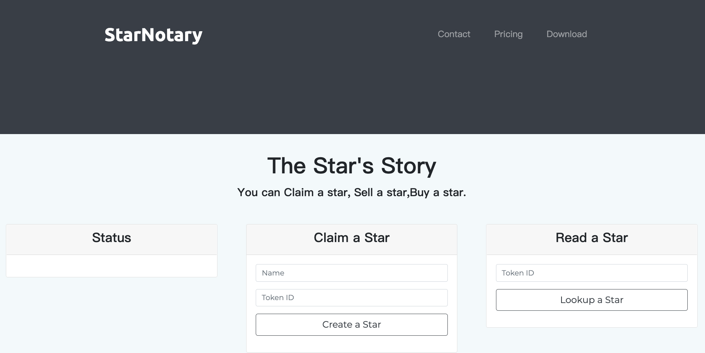

# StarNotary-Ethereum-DAPP

The "StarNotary" is decentralized service , using ES6 with truffle box Webpack. It allows users to claim ownership of their favorite star , lookup a star, sell a star, buy a star in the night sky .


#### Info of project
* Truffle version : "5.0.20 (core: 5.0.20)"
* OpenZeppelin version : "2.1.2"
* ERC-721 Token Name : "MercuryToken"
* ERC-721 Token Symbol : "MET"
* Token Address: "0xFFfCd5594dD56d27EB5f38f6Ab40b7A17bd5b939"
on the Rinkeby Network

## Prerequisites

### Using webpack of Truffle boxes in this project.

"Truffle Boxes are helpful boilerplates that allow you to focus on what makes your DApp unique. In addition to Truffle, Truffle Boxes can contain other helpful modules, Solidity contracts & libraries, front-end views and more; all the way up to complete example dapps"

run the following command:`truffle unbox <box_name>`.In this Project, using `webpack box` because it will help us with the front-end the application and it is simple to use it.

```
$ truffle unbox webpack
```
### Configuring Private network in Metamask
Go to your Metamask Chrome Extension
Use option, Connect using “Custom RPC”, at address http://127.0.0.1:9545/
Use the Private Keys provided by Truffle to import at least two accounts.

### Installing

* Use ```truffle -v``` to verify if you have Truffle installed.
* Use ```npm install -g truffle``` to install Truffle or update it to the latest version.
* Verify that truffle-hdwallet-provider and openzeppelin-solidity dependencies are installed.
If not you can always install it with the following command.

```
npm install --save truffle-hdwallet-provider
```

```
npm install --save openzeppelin-solidity
```

## Running DAPP

To run your application you will need to:

```
$ truffle develop
```
or
```
$ sudo truffle develop commands
```
Every time to compile the contract ,you'd better to delete build folder. and run compile with --all.
```
> compile --all
```
```
> migrate --reset
```

Then

Open a second terminal window, and make sure you are inside your project directory.
Run cd app to move inside the app folder.
Run

```
$ npm run dev
```
`dev` is script of webpack.This will start our port at 8080. Open http://localhost:8080/ in your browser. Make sure the Metamask extension is installed.you are logged into http://127.0.0.1:9545 private network.

## Test DAPP

Run. when did steps of Running DAPP.

```
$ truffle test
```

Tests with Mocha and Chai in TestStarNotary.js.  Using artifacts that is resolver.

Refer to the following


truffle/packages/truffle-require/require.js - [GitHub](https://github.com/tomgtbst/truffle/blob/develop/packages/truffle-require/require.js)

```
 const fs = require("fs");
 const path = require("path");
 const Module = require("module");
 const vm = require("vm");
 const originalrequire = require("original-require");
 const expect = require("truffle-expect");
 const Config = require("truffle-config");
 const Web3Shim = require("truffle-interface-adapter").Web3Shim;

  ...
 const context = {
  ...

  artifacts: options.resolver,
  setImmediate: setImmediate,
  setInterval: setInterval,
  setTimeout: setTimeout

  ...
}
  ...
const script = vm.createScript(source, file);
script.runInNewContext(context);
  ...
```  

It seems like Running a V8 in your computer. The artifacts is resolver, So we can interact with Contracts by ```const StarNotary = artifacts.require("StarNotary");```in TestStarNotary.js

## Migrate DAPP to Rinkeby Test Network

 * You will need to have your Metamask’s seed and Infura setup. Connect Rinkeby network in Metamask and Get Testnet Coins from [Test Ether Faucet](https://faucet.rinkeby.io/) or Google it.
 * Update the truffle.config file to add settings to deploy your contract to the Rinkeby Public Network.
 * Edit your mnemonic of MetaMask in '.secret'


 ```
 const HDWalletProvider =   require('truffle-hdwallet-provider');
 const infuraKey = "INPUT YOUR INFURAKEY";

 const fs = require('fs');
 const mnemonic = fs.readFileSync(".secret").toString().trim();```

```
 rinkeby: {
  provider: () => new HDWalletProvider(mnemonic, `https://rinkeby.infura.io/v3/${infuraKey}`),
    network_id: 4,       // rinkeby's id
    gas: 4500000,        // rinkeby has a lower block limit than mainnet
    gasPrice: 10000000000
},
```

Deploy Contract to Rinkeby:

```
$ truffle migrate --reset --network rinkeby
```

## Versioning

We use [SemVer](http://semver.org/) for versioning. For the versions available, see the [tags on this repository](https://github.com/your/project/tags).

## Authors

* **Tom gt** - *Fullstack egineer* - [github profile](https://github.com/tomgtbst)


## License

This project is licensed under the MIT License
